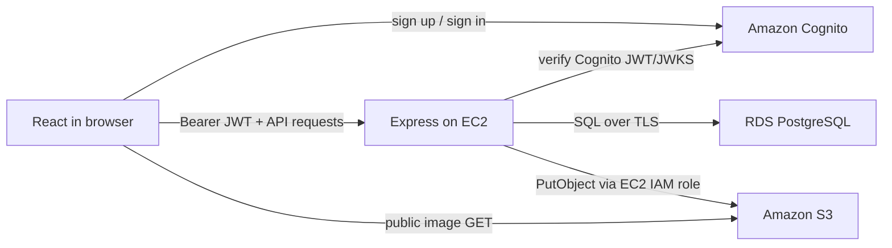

# SavorShare — AWS Recipe Sharing Platform

A production-minded React + Express recipe platform using Cognito authentication, an EC2 application host, RDS PostgreSQL, and S3 images.

## Architecture




## Project layout

- `schema.sql`: PostgreSQL tables, constraints, and indexes
- `backend/`: Express API, Cognito JWT middleware, RDS queries, and S3 uploads
- `frontend/`: Vite React app using Amplify Auth

## Local setup

Requirements: Node.js 20+, npm, and PostgreSQL 15+ (or an accessible RDS instance).

1. Copy `backend/.env.example` to `backend/.env` and `frontend/.env.example` to `frontend/.env`.
2. Fill in the shared Cognito IDs, database connection, region, and bucket.
3. Install and initialize:

   ```bash
   cd backend
   npm install
   npm run db:init
   npm run dev
   ```

4. In another terminal:

   ```bash
   cd frontend
   npm install
   npm run dev
   ```

The UI runs at `http://localhost:5173`; API health is at `http://localhost:5000/api/health`. Vite proxies browser requests from `/api` to the backend, so `VITE_API_URL` should normally remain unset.

## AWS configuration

### Cognito

Create a Cognito User Pool with email sign-in and self-registration. Require `email`, allow the standard `preferred_username` attribute, and create a **public app client with no client secret**. Put its pool and client IDs in both environment files. The backend verifies access-token signature, issuer, client ID, expiry, and token use through Cognito's JWKS.

### RDS PostgreSQL

Create a private PostgreSQL RDS instance. Its security group should allow TCP 5432 only from the EC2 security group. Set the backend `DB_*` variables and run `npm run db:init` once from EC2. For production, use a CA-validated connection or RDS Proxy; the template's `DB_SSL=true` encrypts traffic but accepts the RDS certificate without local CA validation.

### S3

Create a bucket in the configured region. The application assumes recipe objects are publicly readable, as requested. A narrowly scoped bucket policy is:

```json
{
  "Version": "2012-10-17",
  "Statement": [{
    "Sid": "PublicRecipeImages",
    "Effect": "Allow",
    "Principal": "*",
    "Action": "s3:GetObject",
    "Resource": "arn:aws:s3:::YOUR_BUCKET/recipes/*"
  }]
}
```

For a private production bucket, put CloudFront in front of S3 with Origin Access Control and set `S3_PUBLIC_BASE_URL` to the distribution URL. The browser only reads images, so no S3 CORS rule is needed for the current workflow; uploads go through Express.

Attach an IAM role to EC2 rather than storing long-lived AWS keys:

```json
{
  "Version": "2012-10-17",
  "Statement": [{
    "Effect": "Allow",
    "Action": ["s3:PutObject", "s3:DeleteObject"],
    "Resource": "arn:aws:s3:::YOUR_BUCKET/recipes/*"
  }]
}
```

### EC2 deployment

Use Amazon Linux 2023 or Ubuntu 24.04, an EC2 security group allowing SSH from your IP and HTTP/HTTPS publicly, and the IAM role above. Clone the repository on the instance, install Node 20 and Nginx, then:

```bash
cd frontend && npm ci && npm run build
cd ../backend && npm ci --omit=dev && npm run db:init
sudo npm install -g pm2
pm2 start server.js --name recipe-api
pm2 save
pm2 startup
```

Configure Nginx to serve `frontend/dist`, proxy `/api` to `http://127.0.0.1:5000`, and route SPA fallbacks to `index.html`:

```nginx
server {
  listen 80;
  server_name YOUR_DOMAIN_OR_EC2_DNS;
  root /absolute/path/to/frontend/dist;
  index index.html;

  location /api/ {
    proxy_pass http://127.0.0.1:5000;
    proxy_set_header Host $host;
    proxy_set_header X-Forwarded-For $proxy_add_x_forwarded_for;
    proxy_set_header X-Forwarded-Proto $scheme;
  }

  location / { try_files $uri $uri/ /index.html; }
}
```

The frontend defaults to same-origin `/api`, so no API URL is required during the EC2 build. Set `FRONTEND_URL` to the final HTTPS origin. Add TLS with an Application Load Balancer + ACM (recommended) or Certbot, and do not expose port 5000 publicly.

## API

- `GET /api/health`
- `GET /api/recipes?limit=20&offset=0`
- `GET /api/recipes/:id`
- `POST /api/recipes` — authenticated multipart form (`title`, `description`, JSON `ingredients`, `instructions`, `image`)
- `POST /api/recipes/:id/reviews` — authenticated JSON (`rating`, `comment`), upserts one review per user

Uploads accept JPEG, PNG, WebP, or GIF up to 5 MB. The RDS insert is transactional; if it fails after upload, the API compensates by deleting the S3 object.
